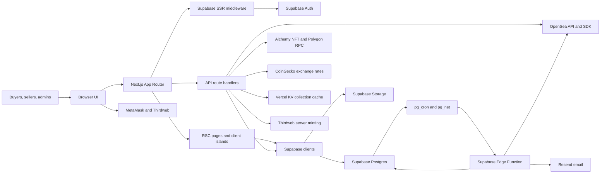
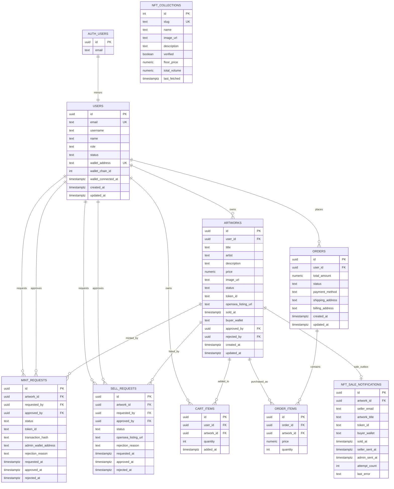

# Rack N Sold - NFT Marketplace

A modern NFT marketplace built with Next.js, allowing users to browse, buy, and sell digital assets on the Polygon blockchain. Features dynamic pricing in PHP with live WETH conversion, NFT minting, and automated OpenSea listings.

## Features

- **Browse NFT collections** from OpenSea on Polygon
- **Real-time updates** with OpenSea Stream API for listings, sales, and transfers
- **Integrated Supabase** for authentication and database
- **MetaMask wallet integration** for seamless blockchain interactions
- **Responsive design** with Tailwind CSS and dark mode support
- **TypeScript** for type safety
- **Server-side rendering** for optimized performance
- **View your own OpenSea NFT collections** and wallet-owned NFTs
- **Artist Portal** for uploading and minting NFTs
- **Dynamic PHP Pricing** with live WETH conversion for artwork listings
- **Automated OpenSea Listings** when sell requests are approved
- **Admin Dashboard** for managing mint and sell requests
- **User Profiles** with editable information and security features

## Prerequisites

- Node.js 18.x or later
- npm or yarn
- Supabase account for authentication and database
- OpenSea API key for accessing the OpenSea API (v2)
- Alchemy API key for connecting to the Polygon blockchain
- MetaMask wallet for blockchain interactions

## Environment Configuration

Create a `.env.local` file in the root directory. See below for required variables.

### Core Environment Variables

```bash
# Supabase Configuration
NEXT_PUBLIC_SUPABASE_URL=your_supabase_url
NEXT_PUBLIC_SUPABASE_ANON_KEY=your_supabase_anon_key
SUPABASE_SERVICE_ROLE_KEY=your_supabase_service_role_key

# Storage Bucket Names
NEXT_PUBLIC_SUPABASE_STORAGE_BUCKET_ARTWORKS=artwork_images
NEXT_PUBLIC_SUPABASE_STORAGE_BUCKET_PROFILES=profile_images

# Application Settings
NEXT_PUBLIC_APP_URL=http://localhost:3000
NEXT_PUBLIC_SITE_URL=http://localhost:3000
NEXT_PUBLIC_APP_NAME=Rack N Sold

# Authentication
NEXT_PUBLIC_AUTH_REDIRECT_URL=http://localhost:3000/auth/callback

# Blockchain Configuration
NEXT_PUBLIC_POLYGON_RPC_URL=https://polygon-mainnet.g.alchemy.com/v2/YOUR_ALCHEMY_KEY
POLYGON_RPC_URL=https://polygon-mainnet.g.alchemy.com/v2/YOUR_ALCHEMY_KEY
NEXT_PUBLIC_POLYGON_CHAIN_ID=137
NEXT_PUBLIC_NFT_CONTRACT_ADDRESS=your_nft_contract_address

# Thirdweb / Admin Wallet
NEXT_PUBLIC_THIRDWEB_CLIENT_ID=your_thirdweb_client_id
THIRDWEB_SECRET_KEY=your_thirdweb_secret_key
THIRDWEB_ADMIN_PRIVATE_KEY=your_admin_wallet_private_key
AUTH_PRIVATE_KEY=your_wallet_auth_private_key

# Alchemy NFT API
ALCHEMY_API_KEY=your_alchemy_api_key
ALCHEMY_NFT_API_URL=https://polygon-mainnet.g.alchemy.com/nft/v3/YOUR_ALCHEMY_KEY

# OpenSea Configuration
OPENSEA_API_KEY=your_opensea_api_key
NEXT_PUBLIC_OPENSEA_API_URL=https://api.opensea.io/api

# Cache / Background Jobs
CRON_SECRET=your_long_random_secret

# Email Notifications
RESEND_API_KEY=your_resend_api_key
RESEND_FROM_EMAIL="Rack N Sold <notifications@yourdomain.com>"
ADMIN_EMAIL=admin@yourdomain.com

# Feature Flags
NEXT_PUBLIC_FEATURE_SELLER_DASHBOARD=true
NEXT_PUBLIC_FEATURE_ADMIN_DASHBOARD=true
```

### NFT Minting Configuration

For NFT minting functionality, you need:
- **NFT Contract Address**: ERC-721 smart contract deployed on Polygon
- **Thirdweb Client and Secret Keys**: Used by server-side mint/signature routes
- **Admin Wallet Private Key**: `THIRDWEB_ADMIN_PRIVATE_KEY` for the wallet that mints and creates listings
- **Polygon RPC URLs**: Both public and private RPC endpoints for blockchain interactions

### Dynamic Pricing (PHP to WETH)

The application automatically fetches live PHP to WETH exchange rates from CoinGecko API. No additional configuration needed beyond what's listed above.

### NFT sale detection (OpenSea) and email notifications

When an NFT is listed on OpenSea (`listed_for_sale`) and later sold, a scheduled job can mark the artwork as `sold`, set `sold_at` and `buyer_wallet`, and email the seller and admin.

**1. Database:** Run the sale tracking and outbox migrations in `supabase/migrations/`:

- [supabase/migrations/20260202120000_artworks_sold_columns.sql](./supabase/migrations/20260202120000_artworks_sold_columns.sql) adds `sold_at` and `buyer_wallet` on `artworks`.
- [supabase/migrations/20260428043000_sale_notification_outbox.sql](./supabase/migrations/20260428043000_sale_notification_outbox.sql) adds the retryable email outbox and sale-recording RPCs.
- [supabase/migrations/20260428044500_schedule_sale_notification_cron.sql](./supabase/migrations/20260428044500_schedule_sale_notification_cron.sql) schedules the Supabase Edge Function every minute.

**2. Supabase Vault secrets:** The Edge Function reads these from Edge Function env vars first, then from Supabase Vault:

```bash
resend_api_key
resend_from_email
admin_email
opensea_api_key
nft_contract_address
```

`poll_opensea_sales_cron_secret` is generated automatically by the scheduling migration and used by `pg_cron` to authenticate the Edge Function call.

**3. Edge Function:** Deploy `supabase/functions/poll-opensea-sales/index.ts` with JWT verification disabled. The function performs custom auth with the Vault-backed `x-cron-secret` header.

**4. Supabase pg_cron:** The scheduling migration creates:

- job name: `poll-opensea-sales-every-minute`
- schedule: `* * * * *`
- target: `https://ukamngdajouofvynqjcn.supabase.co/functions/v1/poll-opensea-sales`

The Edge Function queries OpenSea v2 for `sale` events per listed NFT, marks artworks as sold through an atomic RPC, queues one notification per artwork, and retries pending Resend emails until both seller and admin messages are sent.

## Getting Started

### Installation

```bash
npm install
# or
yarn install
# or
pnpm install
```

### Setup Supabase

1. Create a new Supabase project at [supabase.com](https://supabase.com)
2. Copy your Supabase URL, anon key, and service role key to `.env.local`
3. Run migrations to set up database tables:

```bash
npm run setup:supabase
```

This creates:
- User and profile tables
- Artwork table for storing NFT metadata
- Mint and sell request tracking tables
- Storage policies and buckets

For detailed setup instructions, see [SUPABASE_SETUP.md](./SUPABASE_SETUP.md)

### Run Development Server

```bash
npm run dev
# or
yarn dev
# or
pnpm dev
```

Open [http://localhost:3000](http://localhost:3000) to view the application.

## Key Features & Usage

### 1. Artist Portal & NFT Upload

Sellers can upload artwork and list it for sale:

1. Register at [http://localhost:3000/auth/signup](http://localhost:3000/auth/signup) with "Seller" role
2. Navigate to [http://localhost:3000/artists](http://localhost:3000/artists)
3. Upload an image, add title, description, and **price in PHP**
4. The app shows live WETH equivalent based on current exchange rate
5. Click "Upload Artwork" to save
6. Click "Mint as NFT" to mint the artwork as an NFT on Polygon

**Dynamic PHP Pricing:**
- All prices are entered in **Philippine Peso (PHP)**
- Live WETH equivalent is calculated using CoinGecko's exchange rate API
- When the sell request is approved, PHP price is converted to WETH at current rate
- Disclaimer displayed: "Crypto price is subject to change at the time of listing on OpenSea"

### 2. NFT Minting & OpenSea Listing

**Mint Flow:**
1. Upload artwork as a seller
2. Click "Mint as NFT" button
3. Admin reviews mint request in dashboard
4. Admin approves → NFT is minted on Polygon, token ID is stored

**Sell Flow:**
1. After NFT is minted, sellers can create a "Sell Request"
2. Admin reviews sell request in dashboard
3. Admin approves → NFT is automatically listed on OpenSea with the converted WETH price

### 3. Admin Dashboard

Admins access [http://localhost:3000/admin/mint-requests](http://localhost:3000/admin/mint-requests) to:
- Review and approve mint requests
- Review and approve sell requests
- View transaction hashes and token IDs
- Monitor OpenSea listing URLs

### 4. Browse NFT Collections

- Navigate to **Gallery** to browse all minted NFTs
- View artist details, descriptions, and prices
- Click on NFTs to see detailed information
- View seller profiles and ratings

### 5. Marketplace & Wallet Integration

- **My Collection**: View your OpenSea NFT collection (enter collection slug)
- **My Wallet NFTs**: View NFTs owned by your connected MetaMask wallet
- **Wallet Profile**: View wallet balance, address, and transaction history
- Auto-switch to Polygon network or manually connect wallet

### 6. User Profile Management

- Edit profile information (name, username, email, phone, address)
- Upload and manage profile picture
- Change password securely
- View account details and join date

## Exchange Rate & Pricing

The application uses **CoinGecko's free API** for real-time exchange rates:

- **Endpoint**: `GET /api/exchange-rate`
- **Returns**: PHP to WETH conversion rate
- **Cache**: 60 seconds server-side to prevent rate limits
- **Usage**: Automatic live preview in artwork upload form + conversion on OpenSea listing

No API key required for CoinGecko's free tier.

## Architecture

Rack N Sold is a Next.js App Router application backed by Supabase and Polygon marketplace integrations. The browser-facing layer serves marketing, gallery, auth, account, admin, cart, and NFT detail routes from `app/`, with shared UI and wallet controls in `components/`. Middleware refreshes Supabase sessions, redirects legacy `/marketplace` and `/account` paths, and restricts `/admin` routes to users with the `admin` role.

For a clickable source-derived architecture map, open [docs/architecture-map.html](./docs/architecture-map.html). The companion [docs/architecture-agent-context.json](./docs/architecture-agent-context.json) stores the same repo evidence in machine-readable form for maintainers and AI coding agents.

### System Architecture



### Main Runtime Flows

- **Authentication and roles:** Supabase Auth owns sessions; the public `users` table mirrors app profile data, wallet fields, and roles (`buyer`, `seller`, `admin`).
- **Artwork upload:** Sellers upload images to Supabase Storage and create `artworks` rows with PHP pricing and `draft` status.
- **Mint approval:** A seller creates a `mint_requests` row; admin approval mints an ERC-721 NFT on Polygon through Thirdweb, stores the `transaction_hash` and `token_id`, and moves the artwork to `minted`.
- **OpenSea listing:** A seller creates a `sell_requests` row for a minted artwork; admin approval converts PHP to WETH through `/api/exchange-rate`, creates an OpenSea listing, stores the listing URL, and moves the artwork to `listed_for_sale`.
- **Sale detection:** Supabase `pg_cron` calls the `poll-opensea-sales` Edge Function every minute. The function checks OpenSea sale events, marks matching listed artworks as `sold`, records `sold_at` and `buyer_wallet`, and queues retryable seller/admin emails in `nft_sale_notifications`.
- **Collection and wallet browsing:** OpenSea and Alchemy routes proxy collection, asset, event, metadata, and wallet NFT data. Vercel KV caches collection work and queue state.

### API Surface

- `POST /api/mint/request` - create a mint review request for a draft artwork.
- `POST /api/mint/generate-signature` - generate server-side mint authorization data.
- `POST /api/mint/approve` - approve or reject mint requests; approval mints on Polygon.
- `POST /api/sell/request` - create an OpenSea listing review request for a minted artwork.
- `POST /api/sell/approve` - approve or reject sell requests; approval creates an OpenSea listing.
- `POST /api/artwork/update-status` - update persisted artwork workflow status.
- `GET /api/exchange-rate` - return PHP to WETH conversion data from CoinGecko.
- `GET/POST /api/opensea/*` - proxy OpenSea account, asset, assets, collections, events, and stream operations.
- `GET /api/alchemy/*` - fetch NFT metadata, wallet NFTs, and asset data from Alchemy.
- `GET/POST /api/collections/*` - manage collection cache, setup, checks, and processing queue.
- `POST /api/thirdweb/verify-wallet` - verify wallet ownership/signature data for wallet auth flows.
- `GET/POST /api/cron/poll-opensea-sales` - deprecated compatibility route; sale polling now runs through the Supabase Edge Function.

### Data Model and ERD



### Database Notes

- `users.id` references Supabase Auth users and carries app-specific profile, role, and wallet metadata.
- `artworks.status` drives the NFT workflow: `draft` -> `pending_mint` -> `minted` -> `listed_for_sale` -> `sold`. Rejected mint requests return the artwork to `draft`; rejected sell requests leave the artwork `minted`.
- `mint_requests` and `sell_requests` are admin-reviewed workflow tables. Their `approved_by` fields point back to admin users.
- `nft_sale_notifications` is an Edge Function outbox table from the sale notification migrations. It is represented in SQL migrations and Edge Function code, but it is not yet included in `lib/types/database.ts`.
- Supabase Storage uses public read policies for `artworks`, `artwork_images`, and `profiles`, with authenticated writes constrained to user-owned path segments.
- `nft_collections` stores cached or curated OpenSea collection metadata and is managed by admin-only RLS policies.

### Smart Contracts and External Services

- **ERC-721 on Polygon:** Thirdweb mints NFTs into the configured marketplace/admin wallet.
- **WETH on Polygon:** OpenSea listings are created in WETH after PHP price conversion.
- **OpenSea:** REST, Stream API, and `opensea-js` integrations power collection browsing, asset/event lookups, sale polling, and listing creation.
- **Alchemy:** NFT metadata and wallet-owned NFT lookups, plus Polygon RPC configuration.
- **CoinGecko:** PHP to WETH exchange-rate source used by upload and listing approval flows.
- **Supabase:** Auth, Postgres, Storage, Vault, Edge Functions, `pg_cron`, and `pg_net`.
- **Resend:** Transactional sale notification emails.
- **Vercel KV:** Collection cache and queue backing store.

## Project Structure

- `app/` - Next.js App Router pages, layouts, middleware-adjacent route surfaces, and API route handlers
- `components/` - Reusable UI, auth, layout, NFT, artwork, wallet, legal, and theme components
- `lib/` - Supabase clients/API helpers, hooks, store, OpenSea/Thirdweb services, blockchain utilities, pricing helpers, and shared types
- `supabase/` - Edge Functions and SQL migrations for RLS, storage policies, sale notification outbox, Vault helpers, and scheduled sale polling
- `docs/` - Architecture map, agent context, caching notes, and capstone manual pages
- `public/` - Static assets

## Technology Stack

- **Framework**: Next.js 16.1 (Turbopack)
- **Runtime/UI**: React 19.2, React Server Components, client route islands
- **Language**: TypeScript
- **Styling**: Tailwind CSS, Radix UI, lucide-react, next-themes
- **Authentication**: Supabase Auth
- **Database**: Supabase PostgreSQL with RLS
- **Storage**: Supabase Storage buckets for artwork and profile media
- **Blockchain Integration**: Thirdweb, ethers v5, ethers v6 alias, opensea-js
- **Form Handling**: react-hook-form with zod validation
- **State Management**: Zustand
- **Web3 Integration**: MetaMask SDK, web3-react, Thirdweb provider
- **Background Jobs**: Supabase Edge Functions, `pg_cron`, `pg_net`
- **Caching/Queueing**: Vercel KV
- **Email**: Resend
- **Real-time Exchange Rates**: CoinGecko API

## License

This project is licensed under the MIT License - see the LICENSE file for details.
